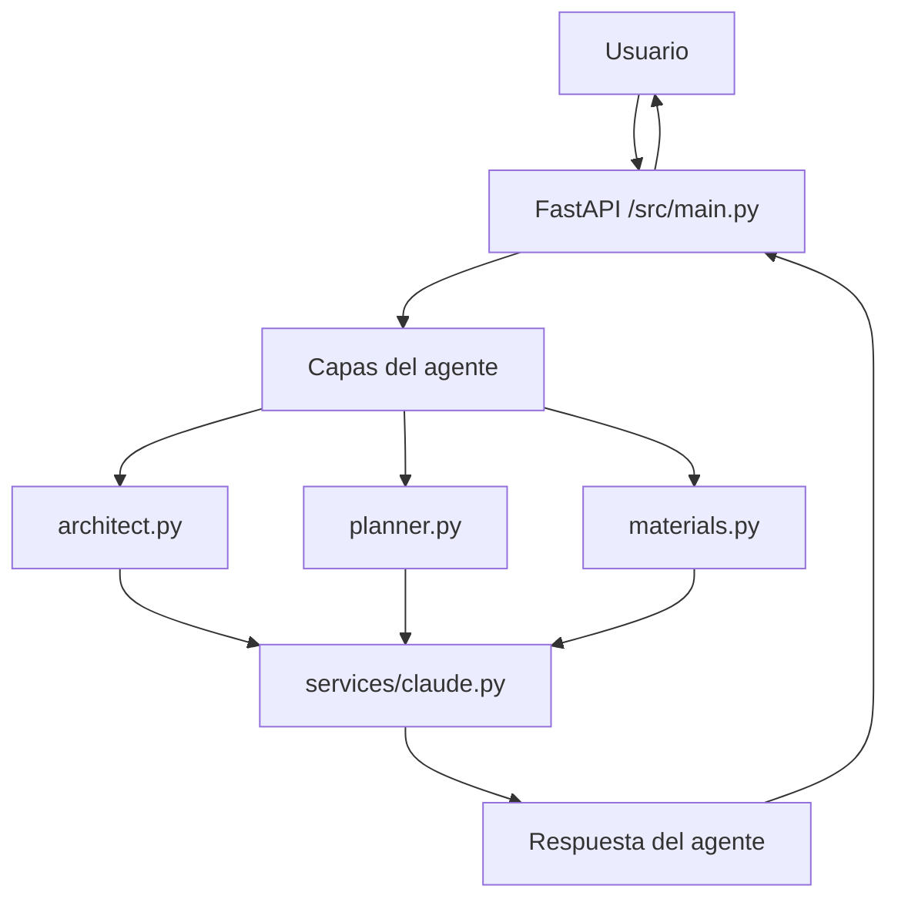

# Minecraft Agent

Agente experimental para Minecraft construido con FastAPI. El proyecto ya tiene una interfaz web profesional, una API para generar planes de construcción y está pensado para exponer el servicio por ngrok.

## Qué hace

- Expone una API web con FastAPI.
- Sirve una interfaz web con formulario, resumen y salida compacta del plan.
- Organiza la lógica en módulos separados para arquitecto, planificador y materiales.
- El cálculo es local y determinista; ngrok solo se usa para exponer el servicio hacia fuera.

## Stack

- Python 3.11+.
- FastAPI.
- Uvicorn.
- python-dotenv.

## Estructura

```text
`src/`
	main.py
	agents/
		architect.py
		materials.py
		planner.py
	prompts/
		architect_prompt.txt
	templates/
		index.html
	static/
		app.js
		styles.css
```

## Diagrama Mermaid

Pega este bloque en [Mermaid Live](https://mermaid.live) para verlo y editarlo:



## Flujo esperado

1. El usuario envía una petición a la API.
2. FastAPI recibe la solicitud en `src/main.py`.
3. Los módulos de `agents/` preparan la estrategia, el plan y los materiales.
4. La API devuelve la respuesta final en JSON y la interfaz web la presenta en una tarjeta visual.

## Cómo ejecutar

```bash
pip install -r requirements.txt
uvicorn src.main:app --reload
```

## Endpoints

- `GET /` muestra la interfaz web.
- `GET /health` confirma que el servicio está arriba.
- `POST /api/build` genera el plan de construcción a partir del texto del usuario.

## Estado del proyecto

- `src/main.py` ya sirve la web y la API.
- Los módulos de `agents/` y `services/` ahora forman el primer flujo funcional del agente.

## Variables de entorno

- Ninguna obligatoria para la generación local.

## ngrok

ngrok se usa solo para exponer la app FastAPI a internet durante pruebas o demostraciones. No reemplaza al modelo ni a la lógica del agente.

## Próximo paso sugerido

Implementar la comunicación entre `main.py`, `planner.py` y `services/claude.py` para que el agente responda acciones concretas dentro del flujo de Minecraft.
